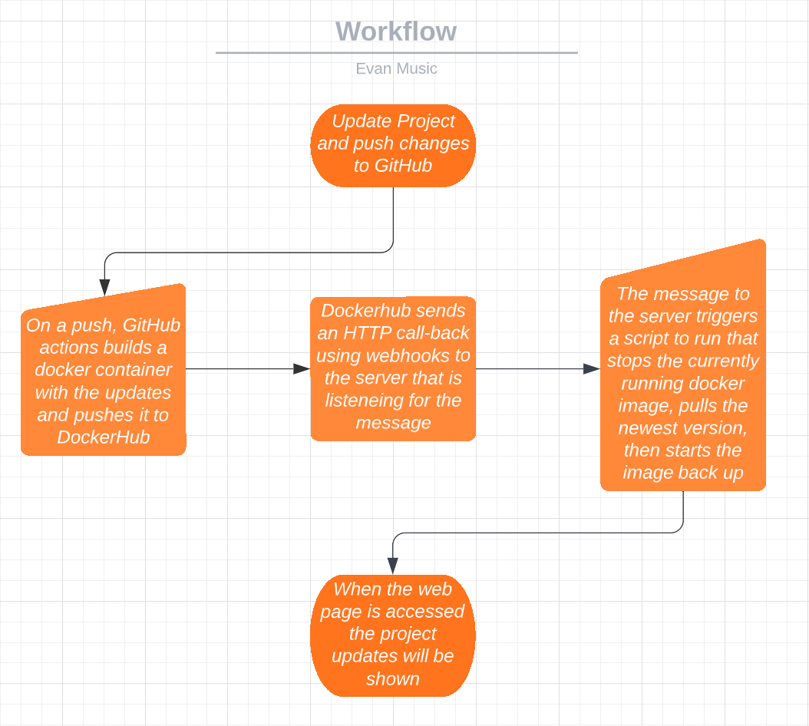

# Building a react application inside of a docker container

## Overview

- I am building a react application in docker using node.js as the web server and `node:19-alpine` as the base image

## Running the project

- Installing Docker on a native linux machine
    - Commands
        - `sudo apt-get remove docker docker-engine docker.io`
        - `sudo apt install docker.io`
        - `sudo snap install docker`
        - `docker --version` to see if docker has installed
        - `sudo docker run hello-world` if you want to quickly test docker
- Building a container from the Dockerfile
    - Command: `sudo docker build -t reactapp:version .`
- Running the container
    - Command: `sudo docker run -d --name react -p 80:3000 reactapp:version`
- View the running project
    - Open a web browser
    - On the same system as the container navigate to `localhost` or `localhost:80`
    - On a different system as the container navigate to the `ipaddress` of the system or `ipaddress:80`

## GitHub Actions and DockerHub

- Create a new DockerHub repository
    - Go to DockerHub
    - Click "Create repository"
    - Add a name and description then choose wether it is public or private
    - Click "Create"
- Authenticating to DockerHub using the cli
    - DockHub needs a username and a token
    - The username is your DockerHub username and the token is created by DockerHub in your account settings
    - I reccomend selecting Read and Write when creating a token to give the least access to get the job done
- Push container to Dockerhub
    - Once you have a built image push it using:
        - `docker push username/imagename:version`
- GitHub secrets
    - DockerHub Username
    - DockerHub Token'
- GitHub workflow
    - What does it do
        - Checkout of the repository
        - Setup Docker builx
        - Login to docker
        - Builds docker image
        - Push docker image to DockerHub
    - What variables are custom
        - Respository name is hard coded in

## Deployment

- Container restart script
    - Pulls the latest docker image
    - Stops the running container
    - Removes the stopped container
    - Runs a new container using the new docker image
- Setting up a webhook on the server
    - Install webhook
        - `sudo apt-get install webhook`
    - Create a `hooks.json` file
        - In here you will add your hooks with the execute command for the script you want to run in our case the restart script
    - Run `webhook -hooks /my/path/to/hooks/hooks.json -verbose`
        - This will start your hook listener 
    - Create a startup script that runs the webhook
        - Allows the webhook to stay running and start when the system start
- Setup a notifier in DockerHub
    - Go to your repository
    - Go to webhooks
    - Add a new webhook
        - `http://ipAddress:9000/hooks/id`

## Diagramming

